# Artificial Mind Project Architecture

## 🎯 Project Overview

The Artificial Mind (Artificial Mind) project is a comprehensive AI system that combines **ethical decision-making**, **hierarchical planning**, **intelligent code generation**, and **self-aware learning** to create an autonomous AI agent capable of understanding, planning, and executing complex tasks while maintaining ethical boundaries.

## 🏗️ System Architecture

```mermaid
graph TB
    %% External Components
    User[👤 User]
    API[🌐 HDN API Server<br/>Port 8081]
    Principles[🔒 Principles Server<br/>Port 8080]
    Monitor[📊 Monitor UI<br/>Port 8082]
    
    %% HDN Core Components
    IE[🧠 Intelligent Executor]
    CG[⚙️ Code Generator]
    CS[💾 Code Storage<br/>Redis]
    DA[🐳 Docker API]
    TR[🧰 Tools Registry]
    PI[🔗 Planner Integration]
    
    %% Event Bus
    subgraph Bus[📡 Event Bus]
      NATS[(NATS Core<br/>agi.events.*)]
    end
    
    %% Planner Components
    HP[🧠 Hierarchical Planner]
    WO[⚙️ Workflow Orchestrator]
    BP[📋 Base Planner]
    
    %% Self-Model Integration
    SM[🧠 Self-Model Manager<br/>Goal Tracking & Learning]
    Redis[💾 Redis<br/>Self-Model Data]
    
    %% LLM & MCP Integration
    LLM1[🤖 LLM Client<br/>Safety Categorization]
    LLM2[🤖 LLM Client<br/>Code Generation]
    LLM3[🤖 LLM Client<br/>Code Fixing]
    MCP[🔌 MCP Knowledge Server<br/>Neo4j / Weaviate Tools]
    
    %% Principles Integration
    PC[🔍 Principles Checker]
    
    %% Execution & Validation
    Docker[🐳 Docker Container<br/>Code Execution]
    Validation[✅ Code Validation]
    
    %% Capability Management
    Capabilities[📚 Capability Library]
    
    %% Safety & Security
    Rules[📋 Ethical Rules<br/>principles.json]
    Block[🚫 Block Harmful Actions]
    
    %% User Connections
    User --> API
    User --> Principles
    User --> Monitor
    
    %% Main Data Flow
    User --> |1. Request Task| API
    API --> |2. Check Principles| PC
    PC --> |3. Generate Code| CG
    CG --> |4. Store Code| CS
    CS --> |5. Execute in Docker| DA
    DA --> |6. Validate Results| Validation
    Validation --> |7. Learn & Update| SM
    SM --> |8. Return Results| User
    
    %% API Connections
    API --> IE
    API --> CG
    API --> CS
    API --> DA
    API --> TR
    API --> PI
    
    %% Event Bus Producers
    API --> |Publish Canonical Events| NATS
    IE --> |Publish Execution Events| NATS
    PI --> |Publish Plan Events| NATS
    
    %% Event Bus Consumers
    HP --> |Subscribe| NATS
    WO --> |Subscribe| NATS
    Monitor --> |Subscribe Observability| NATS
    SM --> |Subscribe Beliefs| NATS
    
    %% Planner Integration
    PI --> HP
    PI --> WO
    PI --> BP
    
    %% Self-Model Flow
    IE --> SM
    SM --> Redis
    IE --> |Record Episode| SM
    IE --> |Update Beliefs| SM
    IE --> |Track Goals| SM
    
    %% LLM & MCP Integration Flow
    IE --> |1. Safety Analysis| LLM1
    LLM1 --> |Returns safety context| IE
    CG --> |2. Generate Code| LLM2
    LLM2 --> |Returns generated code| CG
    IE --> |3. Fix Code| LLM3
    LLM3 --> |Returns fixed code| IE
    API --> |Expose MCP JSON-RPC| MCP
    MCP --> |Knowledge Tools| NATS
    MCP --> |Graph / Vector Queries| Redis
    
    %% Principles Flow
    IE --> PC
    PC --> Principles
    Principles --> Rules
    Rules --> Block
    
    %% Code Execution Flow
    CS --> DA
    DA --> Docker
    Docker --> Validation
    Validation --> CS
    Validation --> IE
    
    %% Capability Management
    CS --> Capabilities
    Capabilities --> API
    TR --> API
    
    %% Styling
    classDef userClass fill:#e1f5fe
    classDef serverClass fill:#f3e5f5
    classDef aiClass fill:#e8f5e8
    classDef storageClass fill:#fff3e0
    classDef securityClass fill:#ffebee
    classDef llmClass fill:#fff9c4
    classDef selfClass fill:#e8eaf6
    classDef plannerClass fill:#f1f8e9
    
    class User userClass
    class API,IE,CG,DA serverClass
    class PC,HP,WO,BP aiClass
    class CS,Capabilities,Redis,TR storageClass
    class Principles,Rules,Block securityClass
    class LLM1,LLM2,LLM3,MCP llmClass
    class SM selfClass
    class PI plannerClass
```



### Recent Capabilities (Implemented)

- **Thinking Mode & Conversational Layer**: Full chat interface with real-time thought streaming, session history, and Chain-of-Thought views in the Monitor UI (proxied via HDN `/api/v1/chat*` APIs).
- **Activity Log & FSM Monitoring**: Human-readable activity log, reasoning traces, hypotheses, curiosity goals, and episodes exposed via FSM HTTP endpoints and surfaced in the Monitor UI.
- **Learning Focus & Meta-Learning**: Outcome-based goal learning, enhanced goal scoring, focused learning strategy, meta-learning about the learning process, and improved semantic concept discovery (see sections below).
- **Multi-Modal Memory System**: Unified working memory (Redis), episodic memory (Qdrant), and semantic/domain knowledge (Neo4j) integrated into HDN, FSM, and Planner flows.
- **Daily Summary Pipeline**: Nightly FSM-triggered HDN execution that generates and persists daily summaries, exposed through dedicated Monitor API endpoints and UI panel.

## 🧩 Core Components

### New: Advanced Reasoning Layer and Knowledge Inference

- **Reasoning Engine** (`fsm/reasoning_engine.go`):
  - Query Neo4j-backed domain knowledge via HDN: `POST /api/v1/knowledge/query`
  - Apply dynamic, data-driven inference rules that adapt to actual concept patterns
  - Generate intrinsic curiosity goals (gap filling, contradictions, exploration, news analysis)
  - Generate testable hypotheses from facts and domain knowledge with intelligent deduplication
  - Screen hypotheses using LLM evaluation for impact and tractability
  - Store news events for automatic goal generation
  - Emit comprehensive reasoning traces with Goal → Steps → Evidence → Conclusion → Confidence
  - Enhanced debug logging for troubleshooting inference execution

- **Knowledge Integration** (`fsm/knowledge_integration.go`):
  - Intelligent exploration tracking to prevent redundant exploration (6-hour cooldown)
  - Comprehensive deduplication to prevent duplicate hypothesis generation
  - Smart re-exploration when new facts are available
  - Data-driven hypothesis generation from actual concept relationships and patterns
  - Fact-based and pattern-based hypothesis creation
  - **Hypothesis Value Pre-Evaluation**: Filters low-value hypotheses (< 0.3 threshold) before generation
  - **Value-Based Confidence Scaling**: Scales hypothesis confidence by potential value
  - **Concept Depth Assessment**: Evaluates concept completeness before hypothesis generation
  - **Actionable Properties Detection**: Identifies concepts with actionable characteristics

- **Knowledge Growth Engine** (`fsm/knowledge_growth.go`):
  - **LLM-Based Semantic Concept Discovery**: Uses HDN API for semantic analysis instead of pattern matching
  - Automatic concept discovery from domain knowledge with meaningful names
  - Knowledge gap identification and filling
  - Concept relationship analysis and enhancement
  - Dynamic knowledge base expansion
  - Quality filtering to prevent generic/low-quality concepts
  - Fallback mechanism when LLM unavailable

- **Build-time**: HDN enables direct Cypher execution with `-tags neo4j`

**Data Flow (Reasoning)**:
- FSM ReasoningEngine → HDN `/api/v1/knowledge/query` → Neo4j → results converted to beliefs
- FSM logs `ReasoningTrace` to Redis keys: `reasoning:traces:<domain>`, `reasoning:traces:goal:<goal>`
- News events stored in Redis: `reasoning:news_relations:recent`, `reasoning:news_alerts:recent`
- Curiosity goals stored in Redis: `reasoning:curiosity_goals:<domain>` with status tracking
- Hypotheses stored in Redis: `fsm:agent_1:hypotheses` with LLM screening scores
- Monitor UI fetches traces at `/api/reasoning/traces/:domain` and displays on the dashboard

**Recent Improvements**:
- **Intelligent Exploration System**: Prevents redundant exploration with time-based avoidance
- **Dynamic Inference Rules**: Data-driven rules that adapt to actual concept patterns
- **Enhanced Debugging**: Detailed logging and proper conclusions in reasoning traces
- **Comprehensive Deduplication**: Prevents duplicate hypothesis generation across all methods
- **Smart Re-exploration**: Re-explores concepts when new facts are available

### 1. **Principles Server** (`principles/`)
- **Purpose**: Ethical decision-making system for AI actions
- **Port**: 8080
- **Key Features**:
  - JSON-based rule configuration
  - Dynamic rule loading without restart
  - Redis caching for performance
  - Fallback support without Redis
  - Context-aware safety checks

### 2. **HDN (Hierarchical Decision Network)** (`hdn/`)
- **Purpose**: AI planning and execution system with ethical safeguards
- **Port**: 8081
- **Key Components**:
  - **Intelligent Executor**: Core orchestration engine
  - **Code Generator**: LLM-powered code generation
  - **Docker API**: Safe code execution environment
  - **Code Storage**: Redis-based capability caching
  - **File Storage**: Redis-based file management with metadata
  - **Workflow Mapping**: Bidirectional mapping between hierarchical and intelligent workflows
  - **Self-Model Manager**: Goal tracking and learning
  - **Tool Registry & Discovery**: Redis-backed catalog (`tool:{id}`, `tools:registry`), bootstrap, discovery, registration APIs (`/api/v1/tools*`)
  - **Tool Executor**: Sandboxed execution (Docker), pre-exec Principles gate, output JSON parsing/normalization, usage logging (`tools:{agent_id}:usage_history`)
  - **MCP Knowledge Server**: Exposes knowledge bases (Neo4j, Weaviate) as MCP tools for LLM access
  - **Composite Tool Provider**: Combines HDN tools and MCP knowledge tools, automatically discovered by the LLM
  - **Conversational Layer**: Natural language interface with chain-of-thought visibility and thought storage
  - **Async LLM Queue System**: Priority-based async queue for all LLM calls with LIFO processing, worker pools, and callback routing
  - **LLM Queue Backpressure**: Queue size limits prevent backlog buildup (high-priority: 100, low-priority: 50, configurable)
  - **Auto-Disable/Enable**: Automatically disables background LLM tasks when queue reaches 90% capacity, re-enables at 50%
  - **Queue Health Monitoring**: Real-time queue statistics and health metrics exposed via API and UI
  - See `Tools.md` for the tool schema, lifecycle, and operational details

For a deeper, HDN-specific architecture diagram and narrative, see `hdn_architecture.md` and `Tools.md`.

### 3. **Planner Evaluator** (`planner_evaluator/`)
- **Purpose**: Advanced hierarchical planning and workflow orchestration
- **Key Components**:
  - **Hierarchical Planner**: Multi-step workflow generation
  - **Workflow Orchestrator**: Execution management with persistent retry counts
  - **Base Planner**: Core planning algorithms
  - **Episode Management**: Execution history and learning

### 4. **Monitor UI** (`monitor/`)
- **Purpose**: Real-time monitoring and visualization
- **Port**: 8082
- **Features**:
  - Workflow status tracking
  - Execution metrics
  - Streaming recent logs (compact panel)
  - System health monitoring
  - Generated file display and access
  - File type icons and metadata
  - Workflow artifact management
  - Capability code previews with modal viewer
  - Project dashboard: create/view projects, link workflows, view artifacts
  - Activity Log panel: human-readable activity stream for FSM activity, reasoning, hypotheses, and learning episodes
  - **Chain of Thought Tab**: Explore AI reasoning process with:
    - Session management with message previews
    - Thought visualization with timestamps, confidence, and metadata
    - Integrated chat interface for creating sessions
    - Real-time thought storage and retrieval
    - Conversation history display
  - **Chat Proxy**: Proxies chat requests to HDN with `show_thinking` enabled
  - **LLM Queue Status Panel**: Real-time monitoring of LLM queue sizes, worker utilization, and auto-disable state
    - High-priority and low-priority queue sizes with percentage indicators
    - Active worker count and capacity
    - Color-coded status indicators (green/orange/red based on queue fullness)
    - Auto-disable status display (🛑 Auto-Disabled, ⏸️ Manually Disabled, ✅ Active)

### 5. **Self-Model** (`self/`)
- **Purpose**: Self-awareness, motivations, and learning
- **Features**:
  - Goal tracking and management (Motivation & Goal Manager)
  - Episode recording with metadata
  - Belief updates based on experience
  - Performance metrics tracking
  - Policy layer for planning/decision influence (desires, goals, principles, policies)

### 6. **FSM Engine** (`fsm/`)
- **Purpose**: Core state management and reasoning engine
- **Key Features**:
  - **Reasoning States**: `reason`, `reason_continue` for intelligent deduction
  - **Knowledge Integration**: Fact extraction, hypothesis generation, and domain knowledge growth
  - **Curiosity Goals**: Autonomous goal generation for knowledge exploration
  - **Dynamic Inference**: Data-driven inference rules that adapt to concept patterns
  - **Intelligent Exploration**: Smart exploration tracking with deduplication and cooldown
  - **Hypothesis Screening**: LLM-based evaluation of hypotheses for impact and tractability
  - **Goal Outcome Learning**: Tracks goal execution outcomes and learns from success/failure
  - **Enhanced Goal Scoring**: Incorporates historical success rates and values into goal prioritization
  - **Focused Learning Strategy**: Identifies promising areas and focuses learning there (70% focused, 30% exploration)
  - **Meta-Learning System**: Learns about its own learning process to continuously improve strategies
  - **Async HTTP Queue System**: Priority-based async queue for all HTTP calls to HDN with LIFO processing, worker pools, and callback routing
- **New Actions**:
  - `reasoning.belief_query` - Query beliefs from knowledge base
  - `reasoning.inference` - Apply inference rules to generate new beliefs
  - `reasoning.curiosity_goals` - Generate curiosity-driven goals
  - `reasoning.explanation` - Generate human-readable explanations
  - `reasoning.trace_logger` - Log reasoning traces
  - `planner.hypothesis_generator` - Generate hypotheses from facts and domain knowledge

Motivation & Goal Manager (policy layer):
- Role: Provides direction/constraints for FSM/HDN by curating active goals and scoring priorities.
- NATS (input): `agi.perception.fact`, `agi.evaluation.result`, `agi.user.goal`
- NATS (output): `agi.goal.created`, `agi.goal.updated`, `agi.goal.progress`, `agi.goal.achieved`, `agi.goal.failed`
- Redis keys:
  - `goals:{agent_id}:active` (SET of goal IDs)
  - `goals:{agent_id}:history` (SET)
  - `goals:{agent_id}:priorities` (ZSET scoring top-N)
  - `goal:{goal_id}` (JSON blob with metadata)
  - Optional config stores for desires/principles/policies as needed
/- Scoring: simple `importance(priority) * confidence` by default; pluggable policy
/- Runtime: subscribes to events, spawns/updates goals, archives achieved/failed

### 7. **Event Bus** (`eventbus/`)
- **Purpose**: Single canonical backbone for all perceptions, messages, telemetry, and inter-module events
- **Technology**: NATS Core (subjects: `agi.events.*`, default: `agi.events.input`)
- **Schema**: Canonical event envelope ensures uniform shape across producers/consumers
- **Tool Events**: `agi.tool.discovered`, `agi.tool.created`, `agi.tool.invoked`, `agi.tool.result`, `agi.tool.failed`

External stimuli (news perception) subjects:

- `agi.events.news.raw` — raw articles
- `agi.events.news.entities` — extracted entities
- `agi.events.news.relations` — extracted relationships (reasoning-friendly)
- `agi.events.news.summaries` — topical summaries
- `agi.events.news.alerts` — high-impact alerts
- `agi.events.news.sentiment` — sentiment/public opinion

Consumers can selectively subscribe (e.g., FSM prioritizes `agi.events.news.relations` and `agi.events.news.alerts`).

**News-Driven Goal Generation**: News events automatically generate curiosity goals:
- News relations create goals like "Analyze news relation: Actor action target"
- News alerts create goals like "Investigate news alert: Headline" with priority based on impact
- Goals progress through status lifecycle: pending → active → completed
- Automatic deduplication prevents duplicate goals

**Intelligent Goal Prioritization System**: Sophisticated scoring mechanism for optimal resource allocation:
- **Priority Scoring**: Multi-factor scoring based on goal type, recency, impact, and importance
- **News Analysis Bonuses**: +2.0 for time-sensitivity, +3.0 for high-impact news, +2.0 for recent news (<1 hour)
- **Technical Concept Bonuses**: +2.0 for important concepts (AI, ML, security, etc.), -1.0 for generic concepts
- **Aging Penalties**: -2.0 for goals >24 hours old, -1.0 for goals >12 hours old, -1.5 for recently tried goals
- **Processing Limits**: Max 3 concurrent active goals per domain with capacity checking
- **Smart Selection**: Goals are sorted by score and highest-scoring eligible goals are selected first

Canonical event example:

```json
{
  "event_id": "evt_20250922_0001",
  "source": "user:alice|webhook:github|sensor:camera01",
  "type": "user_message",
  "timestamp": "2025-09-22T09:15:00Z",
  "context": {
    "channel": "chat",
    "session_id": "sess_abc123",
    "project_id": "project_42"
  },
  "payload": {
    "text": "Please generate a summary of the latest logs.",
    "attachments": [],
    "metadata": {}
  },
  "security": {
    "sensitivity": "low",
    "origin_auth": "api_key_****"
  }
}
```

Implementation:
- Go package `eventbus/` exposes `CanonicalEvent` and `NATSBus` with `Publish(ctx, event)` and `Subscribe(ctx, handler)`.

Example payloads (wrapped in `CanonicalEvent.Payload.Metadata`):

Relations

```json
{
  "id": "rel_20250925_045",
  "head": "Arctic sea ice",
  "relation": "is_shrinking_faster_than",
  "tail": "climate models predicted",
  "confidence": 0.87,
  "source": "bbc",
  "timestamp": "2025-09-25T10:02:00Z"
}
```

Alerts

```json
{
  "alert_type": "breaking",
  "topic": "energy crisis",
  "impact": "high",
  "confidence": 0.95,
  "timestamp": "2025-09-25T10:02:00Z"
}
```
- Demo binaries: `cmd/nats-producer`, `cmd/nats-consumer`.

### 7. Proposed: Project Manager (`projects/`)
- **Purpose**: Manage long-lived projects with sub-goals spanning multiple sessions
- **Responsibilities**:
  - Project lifecycle (create, update, pause, resume, archive)
  - Checkpointing progress and artifacts
  - Linking hierarchical and intelligent workflows to projects
  - Exposing project state to planner and UI

## 🔄 Data Flow

### 1. **Task Request Processing**
```
User Request → HDN API → Safety Analysis → Principles Check → Code Generation → Execution → Learning → Response
```

All significant steps emit canonical events on NATS (e.g., `user_message`, `plan_created`, `step_started`, `execution_result`). Downstream modules subscribe to subjects they care about.

Simple prompts (heuristic) may bypass hierarchical planning and route directly to intelligent execution for a single-step workflow.

**Async Queue Integration**: LLM calls are now processed asynchronously through priority queues:
- High priority requests (user-initiated) processed first
- Low priority requests (background tasks) processed after
- LIFO (Last In, First Out) processing within each priority level
- Worker pool limits concurrent LLM requests to prevent resource exhaustion
- Callback-based response routing ensures proper async handling
- **Backpressure System**: Queue size limits prevent backlog buildup
  - High-priority queue: max 100 requests (configurable via `LLM_MAX_HIGH_PRIORITY_QUEUE`)
  - Low-priority queue: max 50 requests (configurable via `LLM_MAX_LOW_PRIORITY_QUEUE`)
  - Requests rejected when queue is full (immediate error response)
- **Auto-Disable/Enable**: Automatic throttling of background tasks
  - Disables background LLM when low-priority queue reaches 90% (configurable via `LLM_AUTO_DISABLE_THRESHOLD`)
  - Re-enables when queue drops to 50% (configurable via `LLM_AUTO_ENABLE_THRESHOLD`)
  - State persisted in Redis for system-wide coordination
- **Queue Health Monitoring**: Real-time statistics and health metrics
  - Queue sizes, percentages, and worker utilization
  - Periodic health logging (every 30 seconds)
  - Warnings when queues exceed 80% capacity
  - API endpoint: `GET /api/v1/llm/queue/stats` (HDN), `GET /api/llm/queue/stats` (Monitor)
```

### 2. **Hierarchical Planning Flow**
```
Goal → Hierarchical Planner → Workflow Steps → Workflow Orchestrator → Execution → File Generation → Workflow Mapping → Episode Recording
```

### 3. **Self-Learning Loop**
```
Execution Result → Episode Recording → Belief Updates → Goal Status Updates → Capability Learning
```

### 4. **Domain Knowledge Integration Flow**
```
User Request → Domain Knowledge Validation → Planner/Evaluator → Domain-Aware Execution → Knowledge Update
```
- **Input Validation**: Check user inputs against domain constraints (e.g., matrix dimensions)
- **Safety Checking**: Validate actions against domain-specific safety principles
- **Plan Scoring**: Use domain knowledge to score plan options based on success rates and properties
- **Relationship Traversal**: Find related concepts and alternative approaches
- **Knowledge Updates**: Learn from execution results to update domain knowledge

### 5. **MCP Knowledge Integration Flow (Database-First Approach)**
```
User Question → Conversational Layer → Intent Parsing → LLM Sees MCP Tools → 
LLM Chooses MCP Tool → MCP Server → Neo4j/Weaviate Query → Results → LLM Response
```
- **Database-First Strategy**: LLM is encouraged to query knowledge bases before generating responses
- **MCP Tool Discovery**: Composite Tool Provider automatically discovers MCP tools at startup
- **Tool Selection**: LLM sees available MCP tools (`mcp_query_neo4j`, `mcp_get_concept`, etc.) in its prompt
- **Knowledge Query**: When LLM identifies a knowledge question, it can use MCP tools to query databases
- **Response Generation**: LLM incorporates query results into its natural language response
- **When to Use Databases**: Knowledge questions, concept lookups, relationship queries, semantic search
- **When to Use LLM Only**: Creative tasks, code generation, general conversation, tasks requiring reasoning
- **Initialization Verification**: System verifies MCP connectivity at startup to ensure tools are available

### 6. Proposed: Project Flow
```
User defines Project → Project created in Redis → Planner schedules sub-goals →
Workflows execute → Checkpoints saved → Monitor displays progress → Resume across sessions
```

## 🧭 Multi-Step Project/Goal Management (Design)

- **Purpose**: Extend single-request tasks into persistent projects with sub-goals, progress, and resumability.
- **Planner Behavior**: For a given project, planner maintains a queue/backlog of sub-goals, selects next actionable goal each session, and resumes from last checkpoint if interrupted.
- **Monitor UI**: Adds a Projects view showing status, progress %, next action, recent artifacts, and links to related workflows.

### Redis Data Model (Proposed)
- `project:{id}` → hash: `id`, `name`, `description`, `status` (active|paused|archived|completed), `created_at`, `updated_at`, `owner`, `tags[]`
- `project:{id}:goals` → list of JSON goal objects: `goal_id`, `title`, `status`, `priority`, `dependencies[]`, `created_at`, `updated_at`
- `project:{id}:checkpoints` → list: `{checkpoint_id, time, summary, next_action, context{...}}`
- `project:{id}:artifacts` → set/list of `{filename, content_type, size, workflow_id, step_id, created_at}`
- `project_index` → sets for lookup: `projects:by_status:{status}`, `projects:by_owner:{owner}`
- Cross-links:
  - `workflow:{workflow_id}` includes `project_id` when applicable
  - `active_projects` → set of active IDs for quick listing

### Planner Integration (Proposed)
- Accepts `project_id` on plan/execute routes to bind workflows to a project.
- Emits checkpoints after significant milestones; writes `next_action` hints.
- Uses dependencies to order sub-goals; marks complete and advances automatically across sessions.

### Failover & Resumption
- On restart, scan `active_projects` and resume any with pending `next_action` or incomplete goals.
- Store minimal execution context in the latest checkpoint to enable safe continuation.

## 🛠️ Technology Stack

- **Backend**: Go 1.21+
- **Database**: Redis (persistent storage)
- **Event Bus**: NATS (core subjects)
- **Containerization**: Docker
- **LLM**: Ollama (local) / External LLM APIs
- **API**: RESTful HTTP
- **Security**: Principles-based ethical rules
- **Monitoring**: Custom web UI
- **Execution Sandbox**: Docker, with default-permissive permissions for tools (override via `ALLOWED_TOOL_PERMS`)
- **Async Processing**: Priority-based async queues for LLM and HTTP requests with worker pools and LIFO processing

## 📁 Project Structure

```
agi/
├── principles/              # Ethical decision-making API
│   ├── internal/           # Internal packages
│   ├── examples/           # Example integrations
│   ├── config/             # Configuration files
│   └── pkg/                # Public API packages
├── hdn/                    # Hierarchical Decision Network
│   ├── internal/           # Internal packages
│   └── config/             # Configuration files
├── planner_evaluator/      # Advanced planning system
│   ├── hierarchical_planner.go
│   ├── workflow_orchestrator.go
│   ├── planner.go
│   └── hierarchical_integration.go
├── monitor/                # Monitoring UI
├── self/                   # Self-awareness system
├── projects/               # (Proposed) Multi-session project management
├── async_llm/              # Shared async LLM client for command-line tools
│   ├── async_llm_client.go # Async queue implementation
│   └── README.md           # Usage documentation
├── cmd/                    # Command-line tools
│   ├── wiki-summarizer/    # Wikipedia article summarization (uses async_llm)
│   ├── bbc-news-ingestor/  # BBC news classification (uses async_llm)
│   └── wiki-bootstrapper/  # Wikipedia knowledge ingestion
├── fsm/                    # FSM Engine with async HTTP queue
│   ├── async_http_client.go # Async HTTP queue for FSM → HDN calls
│   └── knowledge_integration.go # Uses async HTTP client
├── bin/                    # Built binaries
├── data/                   # Persistent data storage
├── Makefile               # Build automation
├── start_servers.sh       # Server startup script
├── stop_servers.sh        # Server shutdown script
└── test_*.sh             # Integration tests
```

## 🚀 Key Features

### 📁 **File Generation & Management**
- **Multi-format Support**: Generate CSV, PDF, Python, and other file types
- **Data Consistency**: Use local CSV files as input data for PDF generation
- **File Storage**: Redis-based file management with metadata and TTL
- **Workflow Mapping**: Automatic mapping between hierarchical and intelligent workflows
- **File Access**: Direct file access through HDN API and Monitor UI
- **Built-in Module Detection**: Smart handling of Python built-in modules (csv, json, os, etc.)

### ✅ **Safety & Security**
- Principles-based ethical checking
- Docker sandboxing for code execution
- LLM safety analysis
- Harmful action blocking
- Context-aware safety categorization

### 🧠 **Intelligence**
- Natural language task understanding
- Multi-language code generation (Python, Go, JavaScript, Java, C++, Rust)
- Automatic code validation and fixing
- Capability learning and reuse
- Hierarchical workflow planning

### 🧠 **Self-Awareness**
- Goal tracking and management
- Episode recording with detailed metadata
- Belief updates and performance tracking
- Learning from past execution results
- Continuous improvement capabilities

### 🧠 **Domain Knowledge System**
- **Neo4j Graph Database**: Structured knowledge graph for domain-specific concepts, relationships, and constraints
- **Concept Management**: Full CRUD operations for concepts, properties, constraints, and examples
- **Relationship Modeling**: REQUIRES, RELATED_TO, CAN_USE, BLOCKED_BY relationships between concepts
- **Safety Integration**: Links domain concepts to ethical/safety rules via Principles server
- **Constraint Validation**: Input validation against domain rules and limitations
- **Plan Scoring**: Plan evaluation based on domain-specific success rates and properties
- **Knowledge Growth**: Automatic concept discovery and knowledge gap identification
- **Extensible Design**: Support for any domain (Math, Programming, System, etc.)
- **API Integration**: Full REST API at `/api/v1/knowledge/*` for external access

### 🔄 **Scalability**
- Redis-based caching and persistence
- Docker containerization
- RESTful API design
- Microservice architecture
- Workflow orchestration

### 📊 **Monitoring**
- Real-time execution tracking
- Success/failure validation
- Capability library statistics
- Self-model learning metrics
- Comprehensive logging

## 🔧 Development Workflow

### Quick Start
```bash
# Build all components
make build

# Start development mode
make dev

# Run integration tests
make test-integration

# View help
make help
```

### Key Commands
- `make build` - Build all components
- `make dev` - Start development servers
- `make test-integration` - Run integration tests
- `make reset-all` - Full system reset
- `make start-redis` - Start Redis container
- `make examples` - Run example scenarios

## 🔗 API Endpoints

### Principles API (Port 8080)
- `POST /action` - Check if an action is ethically allowed
- `GET /health` - Health check
- `GET /rules` - List current rules

### HDN API (Port 8081)

- Task & Planning
  - `POST /api/v1/task/execute` — Execute a task
  - `POST /api/v1/task/plan` — Plan a task

- Learning
  - `POST /api/v1/learn` — Learn new tasks
  - `POST /api/v1/learn/llm` — Learn from LLM
  - `POST /api/v1/learn/mcp` — Learn from MCP

- Domains
  - `GET /api/v1/domain` — Get current domain
  - `PUT /api/v1/domain` — Update current domain
  - `POST /api/v1/domain/save` — Save current domain
  - `GET /api/v1/domains` — List domains
  - `POST /api/v1/domains` — Create domain
  - `GET /api/v1/domains/{name}` — Get domain by name
  - `DELETE /api/v1/domains/{name}` — Delete domain
  - `POST /api/v1/domains/{name}/switch` — Switch active domain

- Hierarchical Workflows
  - `POST /api/v1/hierarchical/execute` — Execute hierarchical workflow
  - `GET /api/v1/hierarchical/workflow/{id}/status` — Workflow status
  - `POST /api/v1/hierarchical/workflow/{id}/pause` — Pause workflow
  - `POST /api/v1/hierarchical/workflow/{id}/resume` — Resume workflow
  - `POST /api/v1/hierarchical/workflow/{id}/cancel` — Cancel workflow
  - `GET /api/v1/hierarchical/workflows` — List active workflows
  - `GET /api/v1/hierarchical/templates` — List templates
  - `POST /api/v1/hierarchical/templates` — Register template

- Actions (Capabilities by domain)
  - `POST /api/v1/actions` — Create action
  - `GET /api/v1/actions/{domain}` — List actions
  - `GET /api/v1/actions/{domain}/{id}` — Get action
  - `DELETE /api/v1/actions/{domain}/{id}` — Delete action
  - `POST /api/v1/actions/{domain}/search` — Search actions

- Docker
  - `POST /api/v1/docker/execute` — Execute code in Docker
  - `POST /api/v1/docker/primes` — Demo primes endpoint
  - `POST /api/v1/docker/generate` — Generate code (Docker pipeline)

- Files
  - `GET /api/v1/files/{filename}` — Serve file
  - `GET /api/v1/files/workflow/{workflow_id}` — List workflow files
  - `GET /api/v1/workflow/{workflow_id}/files/{filename}` — Serve workflow-specific file

- State
  - `GET /api/v1/state` — Get system state
  - `PUT /api/v1/state` — Update system state

- Intelligent Executor
  - `POST /api/v1/intelligent/execute` — Intelligent execution with file generation
  - `POST /api/v1/intelligent/primes` — Demo primes endpoint
  - `GET /api/v1/intelligent/capabilities` — List cached intelligent capabilities
  - Response includes optional `preview` (code preview grouped by filename)

- LLM Queue Management
  - `GET /api/v1/llm/queue/stats` — Get LLM queue statistics (sizes, workers, auto-disable state)

- Interpreter
  - `POST /api/v1/interpret` — Natural language interpretation
  - `POST /api/v1/interpret/execute` — Interpret and execute

- Domain Knowledge
  - `GET /api/v1/knowledge/concepts` — List all concepts
  - `POST /api/v1/knowledge/concepts` — Create a concept
  - `GET /api/v1/knowledge/concepts/{name}` — Get specific concept
  - `PUT /api/v1/knowledge/concepts/{name}` — Update concept
  - `DELETE /api/v1/knowledge/concepts/{name}` — Delete concept
  - `POST /api/v1/knowledge/concepts/{name}/properties` — Add property
  - `POST /api/v1/knowledge/concepts/{name}/constraints` — Add constraint
  - `POST /api/v1/knowledge/concepts/{name}/examples` — Add example
  - `POST /api/v1/knowledge/concepts/{name}/relations` — Create relationship
  - `GET /api/v1/knowledge/concepts/{name}/related` — Get related concepts
  - `GET /api/v1/knowledge/search` — Search concepts by domain/name
  - `POST /api/v1/knowledge/query` — Execute Cypher queries (Neo4j integration)

- Reasoning & Inference
  - `GET /api/reasoning/traces/{domain}` — Get reasoning traces for domain
  - `GET /api/reasoning/hypotheses/{domain}` — Get generated and screened hypotheses
  - `POST /api/v1/memory/goals/cleanup` — Cleanup internal self-model goals

- Conversational API
  - `POST /api/v1/chat` — Full conversational interface with thinking mode
  - `POST /api/v1/chat/text` — Simple text-only chat
  - `POST /api/v1/chat/stream` — Streaming chat with real-time thoughts
  - `GET /api/v1/chat/sessions` — List all conversation sessions
  - `GET /api/v1/chat/sessions/{sessionId}/history` — Get conversation history
  - `GET /api/v1/chat/sessions/{sessionId}/thoughts` — Get stored thoughts for a session
  - `GET /api/v1/chat/sessions/{sessionId}/thoughts/stream` — Stream thoughts in real-time

- MCP Knowledge Server
  - `POST /mcp` — MCP JSON-RPC endpoint for knowledge tools
  - `POST /api/v1/mcp` — Alternative MCP endpoint
  - Exposes knowledge bases as MCP tools: `query_neo4j`, `search_weaviate`, `get_concept`, `find_related_concepts`

### Monitor UI (Port 8082)
- `GET /` — Dashboard
- `GET /test` — Test page
- `GET /api/status` — Overall system status
- `GET /api/workflows` — Active workflows
- `GET /api/metrics` — Execution metrics
- `GET /api/redis` — Redis info
- `GET /api/docker` — Docker info
- `GET /api/logs` — Recent logs
- `GET /api/ws` — WebSocket endpoint (placeholder)
- `GET /api/files/{filename}` — Access generated files
- `GET /api/workflow/{workflow_id}/files/{filename}` — Access workflow-specific files
- `GET /api/capabilities` — Capabilities (aggregated via HDN)
- `POST /api/interpret` — Proxy to HDN interpreter
- `POST /api/interpret/execute` — Proxy to HDN interpret-and-execute
  - Executes simple prompts directly via intelligent executor
  - Creates/links projects via phrases (e.g., “under/against project ‘X’”)

- Daily Summary
  - `GET /api/daily_summary/latest` — Latest daily summary (Redis-backed)
  - `GET /api/daily_summary/history` — Recent daily summaries (last 30)
  - `GET /api/daily_summary/{date}` — Summary for a specific UTC date

- LLM Queue Monitoring
  - `GET /api/llm/queue/stats` — LLM queue statistics (proxied from HDN)

- Chain of Thought (Proxied to HDN)
  - `GET /api/v1/chat/sessions` — List all conversation sessions
  - `GET /api/v1/chat/sessions/{sessionId}/history` — Get conversation history
  - `GET /api/v1/chat/sessions/{sessionId}/thoughts` — Get stored thoughts for a session
  - `POST /api/chat` — Send chat message with thinking enabled

### Proposed Project API (Port 8081)
- `POST /api/v1/projects` — Create project
- `GET /api/v1/projects` — List projects
- `GET /api/v1/projects/{id}` — Get project
- `PUT /api/v1/projects/{id}` — Update project (metadata, goals)
- `POST /api/v1/projects/{id}/pause` — Pause project
- `POST /api/v1/projects/{id}/resume` — Resume project
- `POST /api/v1/projects/{id}/archive` — Archive project
- `GET /api/v1/projects/{id}/checkpoints` — List checkpoints
- `POST /api/v1/projects/{id}/checkpoints` — Create checkpoint
- `GET /api/v1/projects/{id}/artifacts` — List artifacts

### HDN API (Port 8081)
- Tools
  - `GET /api/v1/tools` — List tools
  - `POST /api/v1/tools` — Register tool
  - `POST /api/v1/tools/discover` — Discover seed tools
  - `POST /api/v1/tools/{id}/invoke` — Invoke tool (Principles-gated)

## 🧪 Testing Strategy

### Unit Tests
- Individual component testing
- Mock external dependencies
- Coverage reporting

### Integration Tests
- End-to-end workflow testing
- Principles integration testing
- HDN-Principles communication testing

### Example Scenarios
- Basic task execution
- Ethical rule enforcement
- Code generation and validation
- Self-learning demonstrations

## 🔒 Security Considerations

### Code Execution Safety
- Docker container isolation
- Resource limits and timeouts
- Network access restrictions
- File system sandboxing

### Ethical Safeguards
- Pre-execution principles checking
- Context-aware safety analysis
- Harmful action blocking
- Audit trail maintenance

### Data Protection
- Redis persistence with encryption
- Secure API communication
- Access control and authentication
- Privacy-preserving learning

## 📈 Performance Characteristics

### Scalability
- Redis-based horizontal scaling
- Docker container orchestration
- Stateless API design
- Caching and optimization

### Reliability
- Fail-safe design patterns
- Graceful degradation
- Error recovery mechanisms
- Comprehensive logging

### Monitoring
- Real-time metrics collection
- Performance tracking
- Resource utilization monitoring
- Alert and notification systems

## 🔄 Recent Improvements

### Async Queue Systems (Latest)
- **✅ HDN Async LLM Queue**: Priority-based async queue system for all LLM calls in HDN
  - High and low priority stacks with LIFO (Last In, First Out) processing
  - Configurable worker pool to limit concurrent LLM requests
  - Callback-based response routing for proper async handling
  - Automatic fallback to synchronous calls when async queue is disabled
  - Environment variable: `USE_ASYNC_LLM_QUEUE=1` to enable
  - Configuration: `LLM_MAX_CONCURRENT_REQUESTS` (default: 2)
- **✅ LLM Queue Backpressure**: Prevents queue backlog buildup
  - Queue size limits: high-priority (100), low-priority (50) - configurable
  - Immediate rejection when queues are full (prevents 800+ request backlogs)
  - Configurable via `LLM_MAX_HIGH_PRIORITY_QUEUE` and `LLM_MAX_LOW_PRIORITY_QUEUE`
- **✅ Auto-Disable/Enable System**: Automatic throttling of background tasks
  - Monitors queue health every 10 seconds
  - Auto-disables background LLM when low-priority queue reaches 90% (configurable)
  - Auto-re-enables when queue drops to 50% (configurable)
  - State persisted in Redis for system-wide coordination
  - Configurable thresholds: `LLM_AUTO_DISABLE_THRESHOLD`, `LLM_AUTO_ENABLE_THRESHOLD`
- **✅ Queue Health Monitoring**: Real-time statistics and observability
  - Queue sizes, percentages, and worker utilization exposed via API
  - Periodic health logging (every 30 seconds)
  - Warnings when queues exceed 80% capacity
  - UI integration: LLM Queue Status panel in Monitor Overview screen
  - API endpoints: `GET /api/v1/llm/queue/stats` (HDN), `GET /api/llm/queue/stats` (Monitor)

- **✅ FSM Async HTTP Queue**: Priority-based async queue system for all HTTP calls from FSM to HDN
  - High and low priority stacks with LIFO processing
  - Configurable worker pool for concurrent HTTP requests
  - Callback-based response routing
  - Automatic fallback to synchronous calls when async queue is disabled
  - Environment variable: `USE_ASYNC_HTTP_QUEUE=1` to enable
  - Configuration: `FSM_MAX_CONCURRENT_HTTP_REQUESTS` (default: 5), `FSM_HTTP_TIMEOUT_SECONDS` (default: 30)

- **✅ Shared Async LLM Client**: Reusable async LLM client package for command-line tools
  - Used by Wiki Summarizer and BBC News Ingestor
  - Supports both Ollama `/api/generate` and `/api/chat` formats
  - Same priority queue architecture as HDN
  - Environment variable: `USE_ASYNC_LLM_QUEUE=1` to enable
  - Configuration: `ASYNC_LLM_MAX_WORKERS` (default: 3), `ASYNC_LLM_TIMEOUT_SECONDS` (default: 60)

- **✅ Kubernetes Configuration**: All async queue settings centralized in `llm-config` secret
  - HDN, FSM, and cron jobs all reference the same secret
  - Easy updates without modifying deployment YAMLs
  - Consistent configuration across all components

**Benefits**:
- No blocking: Requests are queued and processed asynchronously
- Better resource management: Worker pools limit concurrent requests
- Priority handling: High priority requests processed first
- Stack behavior: Most recent requests processed first (LIFO)
- Scalable: Can handle many queued requests without blocking
- No timeouts: Async processing prevents HTTP timeouts

### Advanced Reasoning and Knowledge Integration (Latest)
- **✅ Dynamic Inference Rules**: Data-driven inference rules that adapt to actual concept patterns in the knowledge base
- **✅ Intelligent Exploration System**: Smart exploration tracking with 6-hour cooldown to prevent redundant exploration
- **✅ Comprehensive Deduplication**: Prevents duplicate hypothesis generation across all methods (fact-based, pattern-based, relationship-based)
- **✅ Smart Re-exploration**: Re-explores concepts when new facts are available, even within cooldown period
- **✅ Enhanced Debug Logging**: Detailed logging for troubleshooting inference rule execution with proper conclusions
- **✅ Knowledge Growth Engine**: Automatic concept discovery and knowledge gap identification
- **✅ Hypothesis Screening**: LLM-based evaluation of hypotheses for impact and tractability with configurable thresholds
- **✅ Fact-Based Hypothesis Generation**: Creates hypotheses directly from extracted facts with domain context
- **✅ Pattern-Based Hypothesis Generation**: Generates hypotheses from domain-specific patterns and concepts

### Curiosity Goals System Improvements
- **✅ News-Driven Goals**: News events now automatically generate curiosity goals for analysis
- **✅ Goal Deduplication**: Implemented proper deduplication to prevent duplicate generic goals
- **✅ Status Tracking**: Goals now progress through proper lifecycle: pending → active → completed
- **✅ Goal Cleanup**: Automatic cleanup of old and completed goals to prevent Redis bloat
- **✅ Monitor UI Integration**: Fixed missing Curiosity Goals and Beliefs sections in Monitor UI
- **✅ News Event Storage**: News events are stored in Redis for goal generation
- **✅ Priority-Based Selection**: Goals are selected based on priority and cooldown mechanisms
- **✅ Intelligent Prioritization**: Sophisticated scoring system for goal prioritization based on multiple factors
- **✅ Processing Limits**: Max 3 concurrent active goals per domain with capacity checking
- **✅ Goal Aging**: Automatic deprioritization of old goals and recently tried goals

### FSM ↔ HDN Integration and Delegation
- FSM now delegates capability execution to HDN and marks `hdn_delegate=true`, skipping its own pre-exec principles checks when delegating since HDN performs safety checks.
- Observability: FSM tracks `hdn_inflight`, `hdn_started_at`, `hdn_last_error`, and `last_execution` in context; the FSM UI surfaces these under new panels.
- Project scoping: FSM sets a default `project_id` (`fsm-agent-<agentID>`), ensures the project exists in HDN, and forwards it via header and context for all calls.
- Timeouts: Intelligent execution uses a 120s timeout window for cold-starts; UI explains "cold-start vs cached" behavior.
- Robust retrieval: Capability retrieval tolerates empty lists and non-array payloads.

### File Generation System (Latest Updates)
- **✅ Workflow Mapping**: Implemented bidirectional mapping between hierarchical and intelligent workflow IDs
- **✅ Data Consistency**: PDF files now use real data from local CSV files instead of placeholder content
- **✅ File Storage**: Enhanced Redis-based file storage with metadata, content type detection, and TTL
- **✅ Built-in Module Detection**: Fixed Python package installation to skip built-in modules (csv, json, os, etc.)
- **✅ Final Execution**: Fixed intelligent execution to always store files, even when using cached code
- **✅ UI Integration**: Monitor UI now properly displays generated files with type-specific icons
- **✅ File Access**: Both HDN API and Monitor UI can serve generated files directly

### Technical Improvements
- **Workflow Persistence**: Hierarchical workflows remain visible after completion for artifact access
- **File Type Support**: Enhanced support for PDF, CSV, Python, and other file formats
- **Error Handling**: Improved error handling for file generation and storage
- **Performance**: Optimized file storage and retrieval with Redis indexing

### Daily Summary Pipeline (New)
- Nightly scheduler (FSM): A lightweight scheduler (sleep_cron) in `fsm/server.go` triggers an HDN intelligent execution with `task_name = daily_summary` at 02:30 UTC every day.
- HDN persistence (Redis): When `daily_summary` runs, `handleIntelligentExecute` persists a JSON payload to Redis:
  - `daily_summary:latest` → latest `{date, generated_at, summary}`
  - `daily_summary:YYYY-MM-DD` → per-day payload (UTC date)
  - `daily_summary:history` → rolling list of recent payloads (last 30)
- Monitor API: Read-only endpoints expose summaries for the UI:
  - `GET /api/daily_summary/latest`
  - `GET /api/daily_summary/history`
  - `GET /api/daily_summary/{date}` (YYYY-MM-DD, UTC)
- Monitor UI Panel: Dashboard Daily Summary card with a date picker, Load/Latest actions, current summary view, and recent history preview.

### Learning Focus and Success Improvements (Latest)
- **✅ Priority 1: Goal Outcome Learning System**: Tracks goal execution outcomes, success rates, and average values by goal type/domain
  - `GoalOutcome` struct tracks success/failure, value scores, and outcomes
  - Automatic outcome recording when goals complete/fail
  - Success rate tracking: `goal_success_rate:{type}:{domain}`
  - Average value tracking: `goal_avg_value:{type}:{domain}`
  - Statistics stored in Redis for quick access during goal scoring

- **✅ Priority 2: Enhanced Goal Scoring**: Incorporates historical success data into goal prioritization
  - Historical success rate bonus: up to +3.0 for goal types that succeed often
  - Historical value bonus: up to +2.0 for goal types that yield high value
  - Recent failure penalty: -2.0 for goal types with repeated failures
  - Goals with better historical performance automatically prioritized

- **✅ Priority 3: Hypothesis Value Pre-Evaluation**: Filters low-value hypotheses before testing
  - Evaluates hypothesis potential before generation (threshold: 0.3)
  - Considers: similar hypothesis success rate (30%), concept depth (20%), actionable properties (20%)
  - Filters out generic/low-value hypotheses to reduce wasted effort
  - Scales hypothesis confidence by potential value

- **✅ Priority 4: Focused Learning Strategy**: Identifies promising areas and focuses learning there
  - `LearningProgress` struct tracks success rate, value, and recent progress
  - `identifyFocusAreas()` identifies areas with focus score > 0.5
  - Focus score = (success_rate × 0.4) + (avg_value × 0.4) + (recent_progress × 0.2)
  - `adjustGoalGeneration()` prioritizes focused goals (70% focused, 30% unfocused)
  - Focused goals get 20% priority boost
  - Integrated into `TriggerAutonomyCycle()` for automatic focusing

- **✅ Priority 5: Meta-Learning System**: Learns about its own learning process
  - `MetaLearning` struct tracks goal type values, domain productivity, and success patterns
  - `SuccessPattern` tracking identifies patterns that lead to success
  - Updates automatically after each goal outcome
  - Tracks which goal types are most valuable
  - Tracks which domains are most productive
  - Identifies success patterns for strategy optimization
  - Stored in Redis: `meta_learning:all`

- **✅ Priority 6: Improved Concept Discovery**: Uses semantic analysis instead of pattern matching
  - `extractConceptsWithLLM()` uses HDN API for semantic concept extraction
  - LLM analyzes text and extracts concepts with understanding
  - Generates meaningful concept names (not timestamps)
  - Extracts properties and constraints automatically
  - Quality filtering prevents generic/low-quality concepts
  - Fallback mechanism when LLM unavailable

**Benefits**:
- Higher success rate: Goals from successful areas prioritized
- Better focus: System focuses on promising learning areas
- Reduced waste: Low-value hypotheses filtered out
- Continuous improvement: Meta-learning improves strategies over time
- Better concepts: Semantic analysis produces higher quality concepts
- Efficient learning: Learning efficiency improves over time

## 🔮 Future Enhancements

### Planned Features
- Multi-agent collaboration
- Advanced workflow templates
- Enhanced learning algorithms
- Improved safety mechanisms
- Cloud deployment support

### Proposed: Multi-Step Project/Goal Management
- Persistent, multi-session projects with sub-goals and checkpoints stored in Redis
- Planner tracks progress across sessions and resumes where left off
- Monitor surfaces long-lived missions, progress, artifacts, and next-actions

### Research Areas
- Self-improving AI systems
- Ethical decision-making frameworks
- Hierarchical planning optimization
- Human-AI collaboration patterns

---

## 📝 Maintenance Notes

This architecture document should be updated whenever tools lifecycle, registry schema, or executor policy changes. See `Tools.md` for the canonical tool catalog format and usage.

**Last Updated**: December 2024
**Version**: 1.4
**Maintainer**: Development Team

### Learning Focus Improvements (v1.2)

All six learning focus improvements have been implemented:
- ✅ Goal Outcome Learning System
- ✅ Enhanced Goal Scoring with Historical Success
- ✅ Hypothesis Value Pre-Evaluation
- ✅ Focused Learning Strategy
- ✅ Meta-Learning System
- ✅ Improved Concept Discovery (LLM-based semantic analysis)

See `docs/LEARNING_FOCUS_IMPROVEMENTS.md` and `docs/ALL_LEARNING_IMPROVEMENTS_SUMMARY.md` for complete details.

### Async Queue Systems (v1.3)

All async queue systems have been implemented and integrated:
- ✅ HDN Async LLM Queue System
- ✅ FSM Async HTTP Queue System
- ✅ Shared Async LLM Client Package
- ✅ Kubernetes Configuration Integration
- ✅ Wiki Summarizer Integration
- ✅ BBC News Ingestor Integration

See `hdn/ASYNC_LLM_QUEUE_POC.md` and `async_llm/README.md` for complete details.

### LLM Queue Backpressure & Monitoring (v1.4)

Queue management and monitoring improvements:
- ✅ LLM Queue Backpressure System
- ✅ Auto-Disable/Enable for Background Tasks
- ✅ Queue Health Monitoring & Statistics API
- ✅ UI Integration for Queue Status Display

See `docs/BACKPRESSURE_IMPLEMENTATION.md` for complete details.

## 🔌 Ports and Endpoints Reference

- Principles Server: 8080 (HTTP)
- HDN API Server: 8081 (HTTP)
- Monitor UI: 8082 (HTTP)
- FSM Server: 8083 (HTTP)
- Goal Manager: 8090 (HTTP)
- Redis: 6379 (TCP)
- NATS: 4222 (client), 8222 (monitor)
- Qdrant: 6333 (HTTP), 6334 (gRPC)
- Neo4j Community: 7474 (HTTP UI), 7687 (Bolt)
- RAG Adapter: N/A (we use Qdrant directly; no separate HTTP adapter)
- Ollama: 11434 (HTTP) - LLM API endpoint

Environment variables (defaults):
- RAG_URL: http://localhost:9010
- QDRANT_URL: http://localhost:6333
- NEO4J_URI: bolt://localhost:7687
- NEO4J_USER: neo4j
- NEO4J_PASS: test1234

**Async Queue Configuration**:
- `USE_ASYNC_LLM_QUEUE`: Enable async LLM queue (default: disabled)
- `LLM_MAX_CONCURRENT_REQUESTS`: Max concurrent LLM workers (default: 2)
- `ASYNC_LLM_MAX_WORKERS`: Max workers for async_llm package (default: 3)
- `ASYNC_LLM_TIMEOUT_SECONDS`: Timeout for async LLM requests (default: 60)
- `USE_ASYNC_HTTP_QUEUE`: Enable async HTTP queue for FSM (default: disabled)
- `FSM_MAX_CONCURRENT_HTTP_REQUESTS`: Max concurrent HTTP workers (default: 5)
- `FSM_HTTP_TIMEOUT_SECONDS`: Timeout for HTTP requests (default: 30)
- `DISABLE_BACKGROUND_LLM`: Disable background LLM work (default: 0)

## 🧠 Memory Architecture

### Short-term / Working Memory (Redis)
- Purpose: Ephemeral per-session memory (recent events, latest plan, local variables)
- Storage: Redis with TTLs
- API: `GET /state/session/{id}/working_memory?n=50` (also under `/api/v1/state/...`)

### Episodic Memory (Vector Search via Qdrant)
- Purpose: Store/retrieve episodes (text + metadata) for retrieval-augmented reasoning
- Storage: Qdrant collections (e.g., `agi-episodes`)
- Integration:
  - The smoke tool writes directly to Qdrant using its REST API
  - Production indexing will use structured JSON payloads with metadata:
    - `timestamp`, `session_id`, `plan_id`, `outcome`, `reward`, `tags`, `step_index`, `text`, `metadata`
- Quick start:
```
docker run -d --name qdrant -p 6333:6333 -v $(pwd)/qdrant_storage:/qdrant/storage qdrant/qdrant
```
- Health: `curl -s http://localhost:6333/healthz`

### Semantic Knowledge (Neo4j)
- Purpose: Higher-level invariants, ontology, and symbolic relations used by the planner
- Storage: Neo4j Community Edition
- Client: `hdn/memory/neo4j_client.go` (build-tag `neo4j`), basic CRUD (entity upsert, relation create, entity get)
- Domain Knowledge: `hdn/memory/domain_knowledge.go` (build-tag `neo4j`), structured domain concepts with relationships, constraints, and safety principles
- Quick start (via docker-compose): `docker-compose up -d neo4j`

### Domain Knowledge System
- **Purpose**: Structured knowledge graph for domain-specific concepts, constraints, and relationships
- **Storage**: Neo4j graph database with nodes and relationships
- **Components**:
  - **Concepts**: Domain entities (Matrix Multiplication, Prime Number, Docker Container)
  - **Properties**: Concept characteristics (Associative, Commutative, Portable)
  - **Constraints**: Rules and limitations (A.cols == B.rows, Must be > 1)
  - **Examples**: Worked examples and use cases
  - **Relationships**: Links between concepts (REQUIRES, RELATED_TO, CAN_USE, BLOCKED_BY)
  - **Safety Principles**: Integration with ethical rules and safety constraints
- **API**: Full REST API at `/api/v1/knowledge/*` for CRUD operations
- **Integration**: Used by Planner/Evaluator for input validation, safety checking, and plan scoring
- **Population**: Scripts for initial knowledge population and testing
- **Growth**: Automatic concept discovery and knowledge gap identification via Knowledge Growth Engine
- **Reasoning**: Supports complex Cypher queries for advanced reasoning and inference

### Memory System: Population, Persistence, and Usage

- Sources (Population)
  - Intelligent execution (`/api/v1/intelligent/execute`): records an episodic trace (success/failure, text, tags, workflow_id), appends working-memory events.
  - Hierarchical execution (`/api/v1/hierarchical/execute`): writes a best-effort episodic trace for simple prompts and logs workflow events to working memory.
  - Planner/Evaluator feedback (`planner_evaluator/recordExecutionFeedback`): indexes an `EpisodicRecord` (task, language, duration, outcome) and updates semantic beliefs (success rates, last success timestamps).
  - NATS events (subject `agi.events.input`): API server subscribes and indexes events into episodic memory and recent working events when applicable.

- Persistence Backends
  - Working memory, self-model (beliefs/goals), project/goal state: Redis.
  - Episodic memory: Qdrant collection `agi-episodes`.
  - Fallback: If `RAG_ADAPTER_URL` is unset/unreachable, the HDN server hardwires direct Qdrant usage (ensures collection exists, indexes/searches using a simple embedding).

- Retrieval & Usage
  - Evaluator/Planner: consults semantic beliefs (Redis), episodic episodes (Qdrant), and domain knowledge (Neo4j) to bias plan scoring/selection.
  - Domain Knowledge Integration:
    - Input validation against domain constraints before planning
    - Safety principle checking during plan evaluation
    - Plan scoring based on domain-specific success rates and properties
    - Relationship traversal for finding related concepts and alternatives
  - Monitor UI: displays Working Memory, Beliefs, Goals, and Recent Episodes via the Monitor proxy APIs:
    - `GET /api/memory/summary?session_id=...` → aggregates working memory, beliefs, goals, recent episodes.
    - `GET /api/memory/episodes?q=*&session_id=...` → searches episodic memory.
    - `GET /api/v1/knowledge/concepts` → browse domain knowledge concepts.

- Key HDN Endpoints
  - `GET /api/v1/memory/summary?session_id=...`
  - `GET /api/v1/episodes/search?q=...&session_id=...` (Qdrant-backed when adapter is disabled)
  - `GET /api/v1/knowledge/concepts` (list all domain concepts)
  - `GET /api/v1/knowledge/search?domain=...&name=...` (search domain knowledge)

- Environment & Startup
  - `.env` (loaded by `start_servers.sh`):
    - `HDN_URL`, `PRINCIPLES_URL`
    - Optional: `QDRANT_URL` (default `http://localhost:6333`)
    - Optional: `RAG_ADAPTER_URL` (comment out to force Qdrant fallback)
    - Optional: `NEO4J_URI` (default `bolt://localhost:7687`)
    - Optional: `NEO4J_USER` (default `neo4j`)
    - Optional: `NEO4J_PASS` (default `test1234`)
  - Always start via `./start_servers.sh` to ensure env is loaded and service order is correct.

- Clearing State (Makefile targets)
  - Redis, Qdrant (and optional Neo4j) clears are wired into the reset targets so “clear cache” also clears memory stores.

- Notes
  - The Monitor UI Recent Episodes panel queries the Monitor proxy which forwards to HDN. Default query uses `q=*` with optional `session_id`.
  - Qdrant indexing uses numeric point IDs and requests include `with_payload: true` to return full episodic payloads.

## 🧪 Memory Smoke Tests

### Qdrant Episodic Smoke
- Build/run:
```
make build-memory-smoke
make run-memory-smoke
```
- Behavior:
  - Ensures collection exists (toy schema: 8-dim cosine vector)
  - Upserts one point with payload (`session_id`, `text`, tags, timestamp)
  - Executes a filtered semantic search (by `session_id`)

### Neo4j Smoke (optional)
- Build/run with tag:
```
make build-memory-smoke-neo4j
make run-memory-smoke-neo4j
```
- Behavior: Upserts a `Concept` node and reads it back (`✅ neo4j CRUD ok`)
