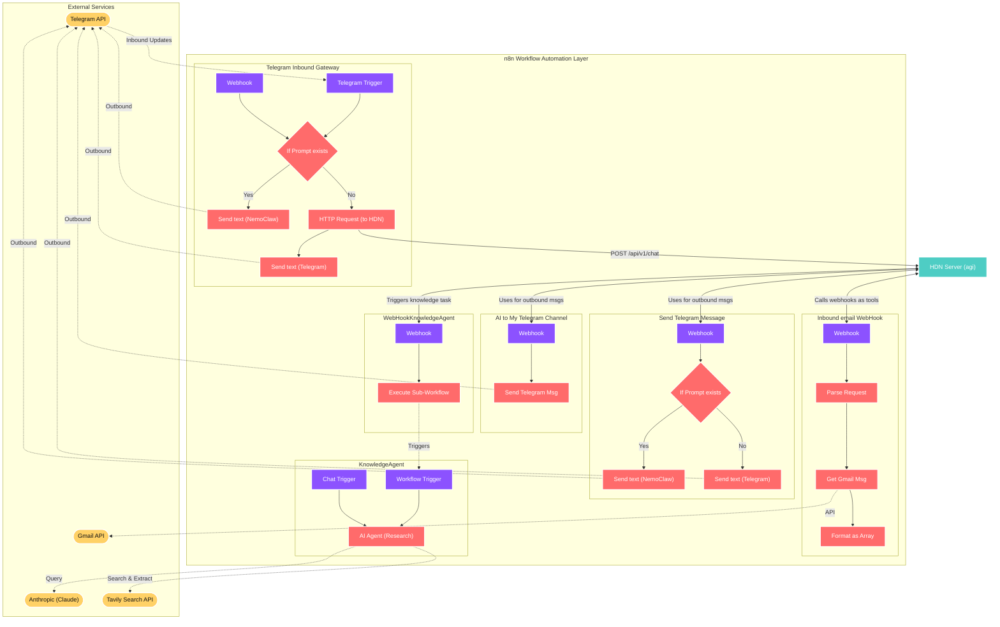

```mermaid
graph TD
    %% Styling
    classDef webhook fill:#8C52FF,stroke:#fff,stroke-width:2px,color:#fff
    classDef n8n fill:#FF6B6B,stroke:#fff,stroke-width:2px,color:#fff
    classDef hdn fill:#4ECDC4,stroke:#fff,stroke-width:2px,color:#fff
    classDef external fill:#FFD166,stroke:#fff,stroke-width:2px,color:#111

    subgraph External["External Services"]
        Telegram(["Telegram API"]):::external
        Gmail(["Gmail API"]):::external
        Anthropic(["Anthropic (Claude)"]):::external
        Tavily(["Tavily Search API"]):::external
    end

    HDN["HDN Server (agi)"]:::hdn

    subgraph n8n_Layer["n8n Workflow Automation Layer"]
        
        %% Workflow: AI to My Telegram Channel
        subgraph WF1["AI to My Telegram Channel"]
            WH1["Webhook"]:::webhook --> TGS1["Send Telegram Msg"]:::n8n
        end

        %% Workflow: Send Telegram Message
        subgraph WF2["Send Telegram Message"]
            WH2["Webhook"]:::webhook --> If2{"If Prompt exists"}:::n8n
            If2 -- "Yes" --> TGS2_1["Send text (NemoClaw)"]:::n8n
            If2 -- "No" --> TGS2_2["Send text (Telegram)"]:::n8n
        end

        %% Workflow: Inbound email WebHook
        subgraph WF3["Inbound email WebHook"]
            WH3["Webhook"]:::webhook --> Parse["Parse Request"]:::n8n
            Parse --> GetG["Get Gmail Msg"]:::n8n
            GetG --> Format["Format as Array"]:::n8n
        end

        %% Workflow: Telegram Inbound Gateway
        subgraph WF4["Telegram Inbound Gateway"]
            TGTrig["Telegram Trigger"]:::webhook
            WH4["Webhook"]:::webhook
            
            TGTrig --> If4{"If Prompt exists"}:::n8n
            WH4 --> If4
            
            If4 -- "Yes" --> TGS4_1["Send text (NemoClaw)"]:::n8n
            If4 -- "No" --> HDN_Call["HTTP Request (to HDN)"]:::n8n
            HDN_Call --> TGS4_2["Send text (Telegram)"]:::n8n
        end
        
        %% Workflow: WebHookKnowledgeAgent
        subgraph WF5["WebHookKnowledgeAgent"]
            WH5["Webhook"]:::webhook --> CallKA["Execute Sub-Workflow"]:::n8n
        end

        %% Workflow: KnowledgeAgent
        subgraph WF6["KnowledgeAgent"]
            SubTrig["Workflow Trigger"]:::webhook
            ChatTrig["Chat Trigger"]:::webhook
            
            SubTrig --> AIAgent["AI Agent (Research)"]:::n8n
            ChatTrig --> AIAgent
        end

    end

    %% Routing
    CallKA -.->|"Triggers"| SubTrig

    %% Service Integration Links
    HDN <-->|"Calls webhooks as tools"| WH3
    HDN <-->|"Uses for outbound msgs"| WH2
    HDN <-->|"Uses for outbound msgs"| WH1
    HDN <-->|"Triggers knowledge task"| WH5
    
    HDN_Call -->|"POST /api/v1/chat"| HDN
    
    Telegram -.->|"Inbound Updates"| TGTrig
    TGS1 -.->|"Outbound"| Telegram
    TGS2_1 -.->|"Outbound"| Telegram
    TGS2_2 -.->|"Outbound"| Telegram
    TGS4_1 -.->|"Outbound"| Telegram
    TGS4_2 -.->|"Outbound"| Telegram
    
    GetG -.->|"API"| Gmail
    
    AIAgent -.->|"Query"| Anthropic
    AIAgent -.->|"Search & Extract"| Tavily
```
