# Artificial Mind System - High-Level Solution Architecture

## Executive Summary

This diagram represents the high-level architecture of an Artificial Mind (Artificial Mind) system that combines ethical decision-making, hierarchical planning, intelligent code generation, and self-aware learning capabilities.

## Architecture Diagram

```mermaid
graph TB
    %% External Layer
    subgraph "External Interface Layer"
        User[👤 User Interface]
        Monitor[📊 Monitoring Dashboard]
    end

    %% Core AI Layer
    subgraph "AI Cognition & Control Layer"
        FSM[🧠 FSM Engine<br/>State Management & Reasoning]
        Principles[🔒 Principles Server<br/>Ethical Decision Making]
        GoalManager[🎯 Goal Manager<br/>Self-Model & Learning]
    end

    %% Planning & Execution Layer
    subgraph "Planning & Execution Layer"
        HDN[🌐 HDN API<br/>Hierarchical Decision Network]
        Planner[📋 Planner/Evaluator<br/>Workflow Orchestration]
        Executor[🤖 Intelligent Executor<br/>Code Generation & Execution]
    end

    %% AI Services Layer
    subgraph "AI Services Layer"
        LLM[🤖 LLM Services<br/>Code Generation & Analysis]
        Reasoning[💭 Reasoning Engine<br/>Knowledge Inference]
        Knowledge[📚 Knowledge Integration<br/>Domain Knowledge & Learning]
    end

    %% Data & Storage Layer
    subgraph "Data & Storage Layer"
        Redis[(💾 Redis<br/>Working Memory & Cache)]
        Qdrant[(🔍 Qdrant<br/>Episodic Memory)]
        Neo4j[(🕸️ Neo4j<br/>Domain Knowledge Graph)]
    end

    %% Infrastructure Layer
    subgraph "Infrastructure Layer"
        Docker[🐳 Docker<br/>Execution Sandbox]
        NATS[📡 NATS<br/>Event Bus]
    end

    %% External Connections
    User -->|Task Requests| HDN
    User -->|Policy Rules| Principles
    User -->|Monitoring| Monitor

    %% AI Layer Connections
    FSM <-->|Delegate Tasks| HDN
    FSM <-->|Ethical Checks| Principles
    FSM <-->|Goal Management| GoalManager
    GoalManager -->|Active Goals| Redis

    %% Planning Layer Connections
    HDN -->|Plan & Execute| Planner
    HDN -->|Code Generation| Executor
    Planner -->|Workflow Events| NATS
    Executor -->|Execution Results| NATS

    %% AI Services Connections
    Executor -->|Code Generation| LLM
    Executor -->|Safety Analysis| LLM
    FSM -->|Knowledge Queries| Reasoning
    Reasoning -->|Domain Knowledge| Knowledge
    Knowledge -->|Knowledge Graph| Neo4j

    %% Data Layer Connections
    HDN -->|Working Memory| Redis
    Planner -->|Episodic Memory| Qdrant
    Executor -->|Code Storage| Redis
    Executor -->|Safe Execution| Docker

    %% Event Bus Connections
    HDN -->|Events| NATS
    FSM -->|Events| NATS
    Monitor -->|Subscribe| NATS

    %% Styling
    classDef externalClass fill:#e3f2fd,stroke:#1976d2,stroke-width:2px
    classDef aiClass fill:#f3e5f5,stroke:#7b1fa2,stroke-width:2px
    classDef planningClass fill:#e8f5e8,stroke:#388e3c,stroke-width:2px
    classDef servicesClass fill:#fff3e0,stroke:#f57c00,stroke-width:2px
    classDef dataClass fill:#fce4ec,stroke:#c2185b,stroke-width:2px
    classDef infraClass fill:#f1f8e9,stroke:#689f38,stroke-width:2px

    class User,Monitor externalClass
    class FSM,Principles,GoalManager aiClass
    class HDN,Planner,Executor planningClass
    class LLM,Reasoning,Knowledge servicesClass
    class Redis,Qdrant,Neo4j dataClass
    class Docker,NATS infraClass
```

## Key Architectural Layers

### 1. **External Interface Layer**
- **User Interface**: Natural language interaction for task requests
- **Monitoring Dashboard**: Real-time system observability and control

### 2. **AI Cognition & Control Layer**
- **FSM Engine**: Core state management and reasoning engine
- **Principles Server**: Ethical decision-making and safety validation
- **Goal Manager**: Self-model management and learning coordination

### 3. **Planning & Execution Layer**
- **HDN API**: Hierarchical Decision Network for task orchestration
- **Planner/Evaluator**: Workflow planning and evaluation
- **Intelligent Executor**: Code generation and safe execution

### 4. **AI Services Layer**
- **LLM Services**: Large Language Model integration for code generation
- **Reasoning Engine**: Knowledge inference and logical deduction
- **Knowledge Integration**: Domain knowledge management and learning

### 5. **Data & Storage Layer**
- **Redis**: Working memory, caching, and session state
- **Qdrant**: Episodic memory and vector search
- **Neo4j**: Domain knowledge graph and relationships

### 6. **Infrastructure Layer**
- **Docker**: Secure code execution sandbox
- **NATS**: Event-driven communication backbone

## Key Architectural Principles

### 🛡️ **Safety-First Design**
- Multi-layer ethical validation
- Sandboxed code execution
- Principles-based decision making

### 🧠 **Self-Aware Intelligence**
- Goal-driven behavior
- Learning from experience
- Self-model management

### 🔄 **Event-Driven Architecture**
- Loose coupling via event bus
- Real-time monitoring and observability
- Scalable microservices design

### 📊 **Multi-Modal Memory**
- Working memory for immediate context
- Episodic memory for experience storage
- Semantic knowledge for domain expertise

### 🎯 **Hierarchical Planning**
- Multi-level task decomposition
- Workflow orchestration
- Intelligent execution delegation

## Technology Stack

- **Backend**: Go 1.21+
- **Databases**: Redis, Qdrant, Neo4j
- **AI/ML**: Ollama (Local LLM), Vector Search
- **Infrastructure**: Docker, NATS
- **APIs**: RESTful HTTP, Event-driven messaging

## Scalability & Performance

- **Horizontal Scaling**: Stateless microservices design
- **Caching Strategy**: Multi-layer Redis caching
- **Event Processing**: Asynchronous NATS messaging
- **Resource Management**: Docker containerization with limits

---

*This architecture represents a comprehensive Artificial Mind system designed for safe, ethical, and intelligent task execution with continuous learning capabilities.*
