# System Overview (High-Level)

```mermaid
graph TB
    %% External Interface Layer
    subgraph External["External Interface Layer"]
        User[👤 User / Client Apps]
        Monitor[📊 Monitor UI<br/>Dashboard & Chain-of-Thought]
    end
    
    %% Cognition & Control Layer
    subgraph Cognition["Cognition & Control Layer"]
        FSM[🧠 FSM Engine<br/>Reasoning & Autonomy]
        GoalMgr[🎯 Goal / Self-Model Manager<br/>Goals, Outcomes, Meta-Learning]
        Principles[🔒 Principles Server<br/>Ethical Rules 8080]
    end
    
    %% Planning & Execution Layer
    subgraph Planning["Planning & Execution Layer"]
        HDN[🌐 HDN API Server 8081<br/>Tasks, Chat, Tools, Memory]
        Planner[📋 Planner Evaluator<br/>Hierarchical Workflows]
        Executor[🤖 Intelligent Executor<br/>Code Gen & Execution]
    end
    
    %% Knowledge, Reasoning & MCP Layer
    subgraph Knowledge["Knowledge & Reasoning Layer"]
        Reasoning[💭 Reasoning Engine<br/>Curiosity & Hypotheses]
        MCP[🔌 MCP Knowledge Server<br/>Neo4j / Weaviate Tools]
        LLM[🤖 LLM Providers<br/>OpenAI / Anthropic / Local]
    end
    
    %% Memory & Data Layer
    subgraph Memory["Memory & Data Layer"]
        Redis[(💾 Redis<br/>Working Memory, Goals, State)]
        Qdrant[(🔍 Qdrant<br/>Episodic Memory / RAG)]
        Neo4j[(🕸️ Neo4j<br/>Domain Knowledge Graph)]
    end
    
    %% Infrastructure & Integration Layer
    subgraph Infra["Infrastructure Layer"]
        Docker[🐳 Docker<br/>Execution Sandbox]
        NATS[📡 NATS Event Bus<br/>agi.events.*]
        Daily[📅 Daily Summary Pipeline<br/>Nightly FSM → HDN job]
    end
    
    %% External Flows
    User -->|Chat, Tasks, Tools| HDN
    User -->|Policy Config| Principles
    User -->|Status, Traces, Activity| Monitor
    
    %% Cognition & Control Flows
    FSM <-->|Delegate Complex Tasks| HDN
    FSM -->|Reasoning State, Curiosity Goals| Reasoning
    FSM -->|Ethical Check Requests| Principles
    FSM -->|Goal Outcomes| GoalMgr
    GoalMgr -->|Goal Scores & Focus Areas| FSM
    GoalMgr -->|Goal Stats & Meta-Learning| Redis
    
    %% Planning & Execution Flows
    HDN -->|Hierarchical Plans| Planner
    Planner -->|Workflow Orchestration| Executor
    HDN -->|Intelligent Execute / Tools| Executor
    Executor -->|Code & Results| Docker
    Executor -->|Working State & Capabilities| Redis
    
    %% Knowledge & Reasoning Flows
    Reasoning -->|Knowledge Queries| HDN
    HDN -->|/api/v1/knowledge/*| Neo4j
    HDN -->|MCP JSON-RPC| MCP
    MCP -->|Graph / Vector Queries| Neo4j
    MCP -->|Vector / Hybrid Search| Qdrant
    Executor -->|Code Gen, Fix, Safety| LLM
    Reasoning -->|Hypothesis Screening| LLM
    
    %% Memory & Data Flows
    HDN -->|Sessions, State, Tools, Projects| Redis
    FSM -->|Beliefs, Goals, Curiosity Data| Redis
    Planner -->|Episodes & Feedback| Qdrant
    HDN -->|Episodic Traces| Qdrant
    Neo4j -->|Domain Constraints & Concepts| Reasoning
    
    %% Event Bus & Observability
    FSM -->|Perception, Reasoning, Learning Events| NATS
    HDN -->|Task, Tool, Memory Events| NATS
    Planner -->|Workflow Events| NATS
    Monitor -->|Subscribe, Render Dashboards| NATS
    Daily -->|Summary Requests| HDN
    HDN -->|Daily Summary JSON| Redis
    Monitor -->|Daily Summary API| Redis
    
    %% Styling
    classDef externalClass fill:#e3f2fd,stroke:#1976d2,stroke-width:1.5px
    classDef cognitionClass fill:#f3e5f5,stroke:#7b1fa2,stroke-width:1.5px
    classDef planningClass fill:#e8f5e8,stroke:#388e3c,stroke-width:1.5px
    classDef knowledgeClass fill:#fff3e0,stroke:#f57c00,stroke-width:1.5px
    classDef memoryClass fill:#fce4ec,stroke:#c2185b,stroke-width:1.5px
    classDef infraClass fill:#f1f8e9,stroke:#689f38,stroke-width:1.5px
    
    class User,Monitor externalClass
    class FSM,GoalMgr,Principles cognitionClass
    class HDN,Planner,Executor planningClass
    class Reasoning,MCP,LLM knowledgeClass
    class Redis,Qdrant,Neo4j memoryClass
    class Docker,NATS,Daily infraClass
```

## Tools Overview

- Tools are registered in the HDN Tool Registry (Redis) and executed via the Tool Executor (Docker).
- FSM selects tools; HDN gates via Principles before execution.
- Events: `agi.tool.*` emitted for discovery, creation, invocation, results, failures.
- See `Tools.md` for catalog, schemas, and usage examples.

## Learning & Knowledge Growth

The system includes advanced learning capabilities:

- **Goal Outcome Learning**: Tracks which goals succeed/fail and learns from outcomes
- **Focused Learning Strategy**: Identifies promising areas and focuses learning there (70% focused, 30% exploration)
- **Meta-Learning**: System learns about its own learning process to continuously improve
- **Semantic Concept Discovery**: Uses LLM-based analysis instead of pattern matching for better concept extraction
- **Hypothesis Value Pre-Evaluation**: Filters low-value hypotheses before testing to reduce wasted effort

See `docs/LEARNING_FOCUS_IMPROVEMENTS.md` for detailed information about these improvements.
