# System Overview (High-Level)

```mermaid
graph TB
    %% Clients
    subgraph Clients
      User[👤 User]
      Monitor[📊 Monitor UI]
    end

    %% Event Bus
    NATS[(📡 NATS Event Bus<br/>agi.events.*)]

    %% Control & Cognition Layer
    subgraph Cognition[🧠 Cognition & Policy]
      FSM[⚙️ FSM Engine]
      SMGM[🧭 Self-Model & Goal Manager]
      Principles[🔒 Principles Server]
    end

    %% HDN / Execution Layer
    subgraph HDNLayer[🛠️ HDN Planning & Execution]
      HDNAPI[🌐 HDN API]
      Planner[🧩 Planner / Evaluator]
      Orchestrator[🧾 Workflow Orchestrator]
      IE[🤖 Intelligent Executor]
      CG[🧪 Code Generator]
    end

    %% Data & Infra
    subgraph Data[💾 Data & Infra]
      Redis[(Redis)]
      Qdrant[(Qdrant<br/>Episodic Memory)]
      Neo4j[(Neo4j<br/>Domain Knowledge)]
      Docker[(Docker<br/>Execution Sandbox)]
    end

    %% Client flows
    User -->|Requests / Goals| HDNAPI
    User -->|Policies / Rules| Principles
    User -->|Observe| Monitor

    %% Monitor observability
    Monitor -->|Subscribe| NATS
    Monitor -->|Query| HDNAPI

    %% HDN publishes events
    HDNAPI -->|Canonical Events| NATS
    Planner -->|Plan/Exec Events| NATS
    Orchestrator -->|Workflow Events| NATS
    IE -->|Exec Results| NATS

    %% FSM ↔ HDN
    FSM <-->|Delegate/Status| HDNAPI

    %% Policy influence
    SMGM -->|Active Goals / Priorities| Redis
    FSM -->|Consult goals| Redis
    Planner -->|Consult goals| Redis

    %% Goal lifecycle
    SMGM -->|agi.goal.*| NATS
    NATS -->|agi.perception.fact<br/>agi.evaluation.result<br/>agi.user.goal| SMGM

    %% Safety checks
    IE -->|Pre-exec check| Principles
    FSM -->|Guards| Principles

    %% Data usage
    HDNAPI --> Redis
    Planner --> Redis
    Orchestrator --> Redis
    IE --> Redis

    Planner -->|Retrieve episodes| Qdrant
    IE -->|Index episodes| Qdrant

    Planner -->|Domain constraints| Neo4j

    IE -->|Run code| Docker

    %% Styling
    classDef clientClass fill:#e1f5fe
    classDef eventClass fill:#fff3e0
    classDef cogClass fill:#f3e5f5
    classDef hdnClass fill:#e8f5e8
    classDef dataClass fill:#fce4ec

    class User,Monitor clientClass
    class NATS eventClass
    class FSM,SMGM,Principles cogClass
    class HDNAPI,Planner,Orchestrator,IE,CG hdnClass
    class Redis,Qdrant,Neo4j,Docker dataClass
```

## Tools Overview

- Tools are registered in the HDN Tool Registry (Redis) and executed via the Tool Executor (Docker).
- FSM selects tools; HDN gates via Principles before execution.
- Events: `agi.tool.*` emitted for discovery, creation, invocation, results, failures.
- See `Tools.md` for catalog, schemas, and usage examples.
