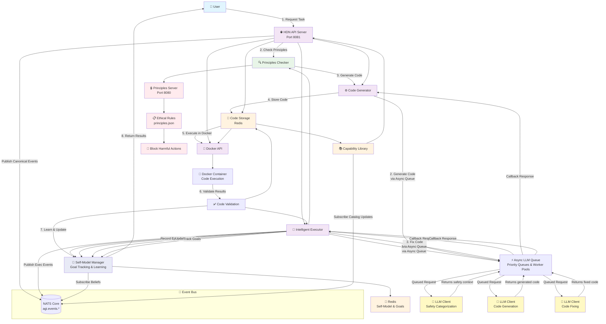

# HDN (Hierarchical Decision Network) System Architecture

## Mermaid Architecture Diagram

## System Components

### 🧠 **Intelligent Executor (IE)**
- **Purpose**: Core orchestration engine
- **Functions**:
  - LLM safety analysis and categorization
  - Principles server integration
  - Code validation and execution
  - Capability caching and reuse
  - Self-model integration for learning

### 🧠 **Self-Model Manager (SM)**
- **Purpose**: Self-awareness and learning system
- **Functions**:
  - Goal tracking and status management
  - Episode recording with detailed metadata
  - Belief updates based on execution results
  - Performance metrics and success rate tracking
  - Learning from past experiences

#### Motivation & Goal Manager (Policy Layer)
- **Role**: Generates/prioritizes goals and influences planner/decider via active goals and priorities.
- **NATS Subjects (input)**: `agi.perception.fact`, `agi.evaluation.result`, `agi.user.goal`
- **NATS Subjects (output)**: `agi.goal.created`, `agi.goal.updated`, `agi.goal.progress`, `agi.goal.achieved`, `agi.goal.failed`
- **Redis Keys**:
  - `goals:{agent_id}:active` — set of current goal IDs
  - `goals:{agent_id}:history` — achieved/failed goals
  - `goals:{agent_id}:priorities` — sorted set for top-N selection
  - `goal:{goal_id}` — JSON blob
- **Scoring**: `priority_importance * confidence` baseline; policies can override.
- **Usage**: Planner/decider consult priorities and filter/score plans; evaluator emits progress to update goals.

### ⚙️ **Code Generator (CG)**
- **Purpose**: Generate executable code from natural language
- **Functions**:
  - LLM prompt engineering
  - Code extraction and cleaning
  - Multi-language support (Python, Go, JavaScript)
  - Test case removal

### 💾 **Code Storage (CS)**
- **Purpose**: Persistent storage and retrieval of generated code
- **Technology**: Redis
- **Functions**:
  - Code caching and versioning
  - Capability library management
  - Search and retrieval

### 🐳 **Docker API (DA)**
- **Purpose**: Safe code execution environment
- **Functions**:
  - Isolated code execution
  - Multi-language runtime support
  - Security sandboxing
  - Output capture

### 🔒 **Principles Server**
- **Purpose**: Ethical and safety validation
- **Functions**:
  - Rule-based action blocking
  - Context-aware safety checks
  - Dynamic rule loading
  - Harmful action prevention

### 🤖 **LLM Client (3 Different Calls)**
- **Purpose**: Natural language processing and code generation
- **Functions**:
  - **Safety Categorization** (`categorizeRequestForSafety()`)
    - Analyzes task requests for safety concerns
    - Returns safety context for principles checking
    - Categorizes as safe/unsafe based on task description
  - **Code Generation** (`GenerateCode()`)
    - Generates executable code from natural language
    - Supports multiple languages (Python, Go, JavaScript)
    - Includes code cleaning and test case removal
  - **Code Fixing** (`fixCodeWithLLM()`)
    - Fixes code when validation fails
    - Improves code based on error feedback
    - Retries with corrected implementation

### ⚡ **Async LLM Queue System**
- **Purpose**: Asynchronous, non-blocking LLM request processing
- **Architecture**:
  - **Priority Stacks**: High and low priority queues with LIFO (Last In, First Out) processing
  - **Worker Pool**: Configurable concurrent workers (default: 2, via `LLM_MAX_CONCURRENT_REQUESTS`)
  - **Response Queue**: Async response handling with callback routing
  - **Request Map**: Tracks requests for proper callback routing
- **Features**:
  - All LLM calls automatically routed through async queue when `USE_ASYNC_LLM_QUEUE=1`
  - High priority requests (user-initiated) processed before low priority (background)
  - Most recent requests processed first within each priority level (LIFO)
  - Automatic fallback to synchronous calls when async queue disabled
  - Prevents HTTP timeouts by decoupling request from response
- **Configuration**:
  - `USE_ASYNC_LLM_QUEUE`: Enable async queue (default: disabled)
  - `LLM_MAX_CONCURRENT_REQUESTS`: Max concurrent LLM workers (default: 2)
  - `DISABLE_BACKGROUND_LLM`: Disable background LLM work (default: 0)
- **Benefits**:
  - No blocking: Requests queued and processed asynchronously
  - Better resource management: Worker pool limits concurrent requests
  - Priority handling: User requests processed before background tasks
  - Scalable: Can handle many queued requests without blocking

## Key Features

### ✅ **Safety & Security**
- Principles-based ethical checking
- Docker sandboxing for code execution
- LLM safety analysis
- Harmful action blocking

### 🚀 **Intelligence**
- Natural language task understanding
- Multi-language code generation
- Automatic code validation
- Capability learning and reuse
- Self-aware learning from experience
- Cached capability reuse with cold-start vs cached execution surfaced to UI

### 🧠 **Self-Awareness**
- Goal tracking and management
- Episode recording with metadata
- Belief updates and performance tracking
- Learning from past execution results
- Continuous improvement capabilities

### 🔄 **Scalability**
- Redis-based caching
- Docker containerization
- RESTful API design
- Microservice architecture

### 📊 **Monitoring**
- Execution time tracking
- Success/failure validation
- Capability library statistics
- Self-model learning metrics
- Comprehensive logging

## Data Flow

1. **User Request** → HDN API Server
2. **Safety Check** → Principles Server
3. **Code Generation** → Async LLM Queue → LLM Client (asynchronous, non-blocking)
4. **Code Storage** → Redis
5. **Code Execution** → Docker Container (or reuse cached result when capability is hot)
6. **Validation** → Results verification
7. **Learning** → Self-Model Manager (goals, episodes, beliefs)
8. **Response** → User with results

**Async Queue Flow**:
- LLM requests enqueued into priority stack (high/low)
- Worker pool processes requests concurrently (limited by `LLM_MAX_CONCURRENT_REQUESTS`)
- Responses routed back via callback functions
- No blocking or timeouts during LLM processing

## Technology Stack

- **Backend**: Go
- **Database**: Redis
- **Containerization**: Docker
- **LLM**: Ollama (Local)
- **API**: RESTful HTTP
- **Security**: Principles-based rules
 - **Project Scoping**: All intelligent/execute and capability routes accept/require `X-Project-ID` and propagate `project_id` in body context
 - **Timeouts**: Intelligent execution keeps a 120s timeout window to accommodate cold-starts
