# HDN (Hierarchical Decision Network) System Architecture

## Mermaid Architecture Diagram

```mermaid
graph TB
    %% External Components
    User[👤 User]
    API[🌐 HDN API Server<br/>Port 8081]
    Principles[🔒 Principles Server<br/>Port 8080]
    
    %% HDN Core Components
    IE[🧠 Intelligent Executor]
    CG[⚙️ Code Generator]
    CS[💾 Code Storage<br/>Redis]
    DA[🐳 Docker API]
    
    %% Event Bus
    subgraph Bus[📡 Event Bus]
      NATS[(NATS Core<br/>agi.events.*)]
    end
    
    %% Self-Model Integration
    SM[🧠 Self-Model Manager<br/>Goal Tracking & Learning]
    Redis[💾 Redis<br/>Self-Model & Goals]
    
    %% LLM Integration
    LLM1[🤖 LLM Client<br/>Safety Categorization]
    LLM2[🤖 LLM Client<br/>Code Generation]
    LLM3[🤖 LLM Client<br/>Code Fixing]
    AsyncLLM[⚡ Async LLM Queue<br/>Priority Queues & Worker Pools]
    
    %% Principles Integration
    PC[🔍 Principles Checker]
    
    %% Execution & Validation
    Docker[🐳 Docker Container<br/>Code Execution]
    Validation[✅ Code Validation]
    
    %% Capability Management
    Capabilities[📚 Capability Library]
    
    %% Safety & Security
    Rules[📋 Ethical Rules<br/>principles.json]
    Block[🚫 Block Harmful Actions]
    
    %% Main User Flow
    User --> |1. Request Task| API
    API --> |2. Check Principles| PC
    PC --> Principles
    PC --> |3. Generate Code| CG
    CG --> |4. Store Code| CS
    CS --> |5. Execute in Docker| DA
    DA --> Docker
    Docker --> |6. Validate Results| Validation
    Validation --> |7. Learn & Update| SM
    SM --> |8. Return Results| User
    
    %% API Connections
    API --> IE
    API --> CG
    API --> CS
    API --> DA
    
    %% Event Bus Connections
    API --> |Publish Canonical Events| NATS
    IE --> |Publish Exec Events| NATS
    SM --> |Subscribe Beliefs| NATS
    Capabilities --> |Subscribe Catalog Updates| NATS
    
    %% Self-Model Flow
    IE --> SM
    SM --> Redis
    IE --> |Record Episode| SM
    IE --> |Update Beliefs| SM
    IE --> |Track Goals| SM
    
    %% LLM Integration Flow
    IE --> |1. Safety Analysis<br/>via Async Queue| AsyncLLM
    AsyncLLM --> |Queued Request| LLM1
    LLM1 --> |Returns safety context| AsyncLLM
    AsyncLLM --> |Callback Response| IE
    CG --> |2. Generate Code<br/>via Async Queue| AsyncLLM
    AsyncLLM --> |Queued Request| LLM2
    LLM2 --> |Returns generated code| AsyncLLM
    AsyncLLM --> |Callback Response| CG
    IE --> |3. Fix Code<br/>via Async Queue| AsyncLLM
    AsyncLLM --> |Queued Request| LLM3
    LLM3 --> |Returns fixed code| AsyncLLM
    AsyncLLM --> |Callback Response| IE
    
    %% Principles Flow
    IE --> PC
    Principles --> Rules
    Rules --> Block
    
    %% Code Execution Flow
    CS --> DA
    Validation --> CS
    Validation --> IE
    
    %% Capability Management
    CS --> Capabilities
    Capabilities --> API
    
    %% Styling
    classDef userClass fill:#e1f5fe
    classDef serverClass fill:#f3e5f5
    classDef aiClass fill:#e8f5e8
    classDef storageClass fill:#fff3e0
    classDef securityClass fill:#ffebee
    classDef llmClass fill:#fff9c4
    classDef selfClass fill:#e8eaf6
    
    class User userClass
    class API,IE,CG,DA serverClass
    class PC aiClass
    class CS,Capabilities,Redis storageClass
    class Principles,Rules,Block securityClass
    class LLM1,LLM2,LLM3 llmClass
    class SM selfClass
```

## System Components

### 🧠 **Intelligent Executor (IE)**
- **Purpose**: Core orchestration engine with intelligent learning capabilities
- **Functions**:
  - LLM safety analysis and categorization
  - Principles server integration
  - Code validation and execution
  - Capability caching and reuse
  - Self-model integration for learning
  - **Failure Pattern Learning**: Records common error patterns (compilation, runtime, validation) by language and task category
    - Tracks error frequency, success rates after fixes, and common fixes
    - Stores patterns in Redis: `failure_pattern:{type}:{category}:{language}`
    - Generates prevention hints from learned patterns: `prevention_hint:{type}:{category}:{language}`
  - **Prevention Hint System**: Retrieves learned prevention hints and adds them to code generation prompts
    - Searches Redis for relevant hints based on task category and language
    - Only uses hints for patterns that occurred at least 2 times (proven patterns)
    - Adds hints to prompts as "🧠 LEARNED FROM EXPERIENCE - Common errors to avoid"
  - **Code Generation Strategy Learning**: Tracks effectiveness of different strategies
    - Monitors prompt styles, success rates, average retries, and quality scores
    - Stores strategies in Redis: `codegen_strategy:{category}:{language}`
    - Prioritizes successful strategies in future code generation
  - **Intelligent Prompt Enhancement**: Automatically enhances prompts with learned knowledge
    - Retrieves prevention hints before code generation
    - Incorporates successful strategies into prompt construction
    - Logs intelligence activity for observability

### 🧠 **Self-Model Manager (SM)**
- **Purpose**: Self-awareness and learning system
- **Functions**:
  - Goal tracking and status management
  - Episode recording with detailed metadata
  - Belief updates based on execution results
  - Performance metrics and success rate tracking
  - Learning from past experiences

#### Motivation & Goal Manager (Policy Layer)
- **Role**: Generates/prioritizes goals and influences planner/decider via active goals and priorities.
- **NATS Subjects (input)**: `agi.perception.fact`, `agi.evaluation.result`, `agi.user.goal`
- **NATS Subjects (output)**: `agi.goal.created`, `agi.goal.updated`, `agi.goal.progress`, `agi.goal.achieved`, `agi.goal.failed`
- **Redis Keys**:
  - `goals:{agent_id}:active` — set of current goal IDs
  - `goals:{agent_id}:history` — achieved/failed goals
  - `goals:{agent_id}:priorities` — sorted set for top-N selection
  - `goal:{goal_id}` — JSON blob
- **Scoring**: `priority_importance * confidence` baseline; policies can override.
- **Usage**: Planner/decider consult priorities and filter/score plans; evaluator emits progress to update goals.

### ⚙️ **Code Generator (CG)**
- **Purpose**: Generate executable code from natural language
- **Functions**:
  - LLM prompt engineering
  - Code extraction and cleaning
  - Multi-language support (Python, Go, JavaScript)
  - Test case removal

### 💾 **Code Storage (CS)**
- **Purpose**: Persistent storage and retrieval of generated code
- **Technology**: Redis
- **Functions**:
  - Code caching and versioning
  - Capability library management
  - Search and retrieval

### 🐳 **Docker API (DA)**
- **Purpose**: Safe code execution environment
- **Functions**:
  - Isolated code execution
  - Multi-language runtime support
  - Security sandboxing
  - Output capture

### 🔒 **Principles Server**
- **Purpose**: Ethical and safety validation
- **Functions**:
  - Rule-based action blocking
  - Context-aware safety checks
  - Dynamic rule loading
  - Harmful action prevention

### 🤖 **LLM Client (3 Different Calls)**
- **Purpose**: Natural language processing and code generation
- **Functions**:
  - **Safety Categorization** (`categorizeRequestForSafety()`)
    - Analyzes task requests for safety concerns
    - Returns safety context for principles checking
    - Categorizes as safe/unsafe based on task description
  - **Code Generation** (`GenerateCode()`)
    - Generates executable code from natural language
    - Supports multiple languages (Python, Go, JavaScript)
    - Includes code cleaning and test case removal
  - **Code Fixing** (`fixCodeWithLLM()`)
    - Fixes code when validation fails
    - Improves code based on error feedback
    - Retries with corrected implementation

### ⚡ **Async LLM Queue System**
- **Purpose**: Asynchronous, non-blocking LLM request processing
- **Architecture**:
  - **Priority Stacks**: High and low priority queues with LIFO (Last In, First Out) processing
  - **Worker Pool**: Configurable concurrent workers (default: 2, via `LLM_MAX_CONCURRENT_REQUESTS`)
  - **Response Queue**: Async response handling with callback routing
  - **Request Map**: Tracks requests for proper callback routing
  - **Backpressure Limits**: Queue size limits prevent backlog buildup
  - **Health Monitor**: Periodic queue health monitoring and logging
- **Features**:
  - All LLM calls automatically routed through async queue when `USE_ASYNC_LLM_QUEUE=1`
  - High priority requests (user-initiated) processed before low priority (background)
  - Most recent requests processed first within each priority level (LIFO)
  - Automatic fallback to synchronous calls when async queue disabled
  - Prevents HTTP timeouts by decoupling request from response
  - **Backpressure**: Rejects requests when queues are full (prevents 800+ request backlogs)
  - **Auto-Disable/Enable**: Automatically throttles background tasks based on queue health
- **Configuration**:
  - `USE_ASYNC_LLM_QUEUE`: Enable async queue (default: disabled)
  - `LLM_MAX_CONCURRENT_REQUESTS`: Max concurrent LLM workers (default: 2)
  - `LLM_MAX_HIGH_PRIORITY_QUEUE`: Max high-priority requests (default: 100)
  - `LLM_MAX_LOW_PRIORITY_QUEUE`: Max low-priority requests (default: 50)
  - `LLM_AUTO_DISABLE_THRESHOLD`: Queue percentage to disable background LLM (default: 0.90)
  - `LLM_AUTO_ENABLE_THRESHOLD`: Queue percentage to re-enable background LLM (default: 0.50)
  - `DISABLE_BACKGROUND_LLM`: Manually disable background LLM work (default: 0)
- **Benefits**:
  - No blocking: Requests queued and processed asynchronously
  - Better resource management: Worker pool limits concurrent requests
  - Priority handling: User requests processed before background tasks
  - Scalable: Can handle many queued requests without blocking
  - **Backpressure Protection**: Prevents queue backlog buildup
  - **Automatic Throttling**: Self-regulating system prevents overload
  - **Observability**: Real-time queue statistics via API and UI

## Key Features

### ✅ **Safety & Security**
- Principles-based ethical checking
- Docker sandboxing for code execution
- LLM safety analysis
- Harmful action blocking

### 🚀 **Intelligence**
- Natural language task understanding
- Multi-language code generation
- Automatic code validation
- Capability learning and reuse
- Self-aware learning from experience
- Cached capability reuse with cold-start vs cached execution surfaced to UI
- **Failure Pattern Learning**: System learns from code generation failures and stores patterns in Redis
- **Prevention Hints**: Learned prevention hints automatically added to code generation prompts
- **Strategy Learning**: Tracks and prioritizes successful code generation strategies
- **Intelligent Improvement**: Uses learned knowledge to avoid previously encountered errors

### 🧠 **Self-Awareness**
- Goal tracking and management
- Episode recording with metadata
- Belief updates and performance tracking
- Learning from past execution results
- Continuous improvement capabilities

### 🔄 **Scalability**
- Redis-based caching
- Docker containerization
- RESTful API design
- Microservice architecture

### 📊 **Monitoring**
- Execution time tracking
- Success/failure validation
- Capability library statistics
- Self-model learning metrics
- Comprehensive logging

## Data Flow

1. **User Request** → HDN API Server
2. **Safety Check** → Principles Server
3. **Intelligence Enhancement** → Retrieve learned prevention hints from Redis → Add to prompt
4. **Code Generation** → Async LLM Queue → LLM Client (asynchronous, non-blocking, with prevention hints)
5. **Code Storage** → Redis
6. **Code Execution** → Docker Container (or reuse cached result when capability is hot)
7. **Validation** → Results verification
8. **Learning** → Record failure patterns if validation fails → Generate prevention hints → Update strategies
9. **Learning** → Self-Model Manager (goals, episodes, beliefs)
10. **Response** → User with results

**Async Queue Flow**:
- LLM requests enqueued into priority stack (high/low)
- Backpressure check: Rejects if queue is full (immediate error response)
- Worker pool processes requests concurrently (limited by `LLM_MAX_CONCURRENT_REQUESTS`)
- Responses routed back via callback functions
- No blocking or timeouts during LLM processing
- Health monitor checks queue size every 10 seconds
- Auto-disable triggers when low-priority queue reaches threshold
- Auto-enable triggers when queue clears below threshold

## Technology Stack

- **Backend**: Go
- **Database**: Redis
- **Containerization**: Docker
- **LLM**: Ollama (Local)
- **API**: RESTful HTTP
- **Security**: Principles-based rules
 - **Project Scoping**: All intelligent/execute and capability routes accept/require `X-Project-ID` and propagate `project_id` in body context
 - **Timeouts**: Intelligent execution keeps a 120s timeout window to accommodate cold-starts
 - **Queue Management**: LLM queue statistics exposed via `GET /api/v1/llm/queue/stats` endpoint
   - Returns queue sizes, worker utilization, and auto-disable state
   - Monitor UI displays real-time queue status in Overview screen
   - Health monitoring logs queue metrics every 30 seconds
